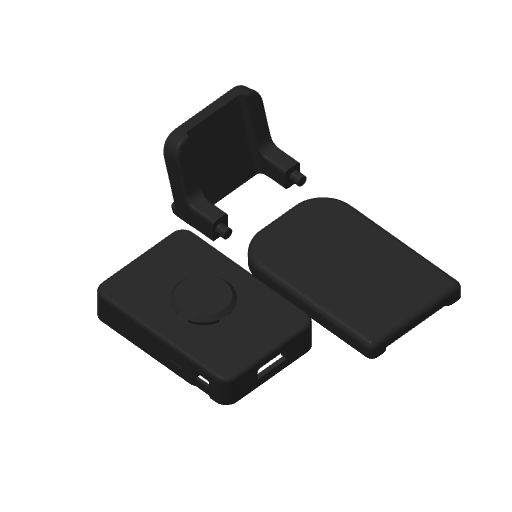

<a id="start-here"></a>

<table>
<tr>
<td width="620" valign="middle">
<h1>Physical Taby</h1>
<p><strong>Your Taby, with a little place on your desk.</strong></p>
<p>
  <a href="https://www.heytaby.com">Meet Taby</a> &nbsp;·&nbsp;
  <a href="https://www.heytaby.com/setup">Get the desktop app</a><br>
  <a href="#bring-taby-to-life">Install firmware</a> &nbsp;·&nbsp;
  <a href="https://github.com/TRIIIS-LABS/firmware-taby/releases/download/prints-1.64-1.0.0/taby-1.64-print-pack-1.0.0.zip">Download 3D print files</a>
</p>
</td>
<td width="240" align="center" valign="middle">
<a href="https://www.heytaby.com"></a>
</td>
</tr>
</table>

**Taby is a new kind of personal computer.** The [app](https://www.heytaby.com/setup)
works on its own. Want a physical Taby on your desk too? Build one with the
**firmware, animations, and case files** here.

**Let's make one:** [1. Choose your board](#supported-displays) →
[2. Install the firmware](#bring-taby-to-life) →
[3. Connect to Taby](#connect-to-taby) →
[4. Print a case](#a-home-for-your-taby)

---

<a id="supported-displays"></a>

## 1. 🖥️ Choose your board

You'll need a supported board and a **USB data cable**.

<table>
<tr>
<td width="430" valign="top">
<h3>Taby 1.64</h3>
<p>The rectangular one.<br>280 × 456 AMOLED · 84 animations</p>
<p><strong>Waveshare ESP32-S3-Touch-AMOLED-1.64</strong></p>
<p><a href="https://www.waveshare.com/product/esp32-s3-touch-amoled-1.64.htm">Get the board ↗</a> &nbsp;·&nbsp; <a href="#a-home-for-your-taby">Print its case</a></p>
</td>
<td width="430" valign="top">
<h3>Taby Round 1.32</h3>
<p>The round little one.<br>466 × 466 AMOLED · 27 animations</p>
<p><strong>Waveshare ESP32-S3-Touch-AMOLED-1.32</strong></p>
<p><a href="https://www.waveshare.com/product/esp32-s3-touch-amoled-1.32.htm">Get the board ↗</a> &nbsp;·&nbsp; Case coming soon</p>
</td>
</tr>
</table>

**More screens coming soon.** Check [board compatibility](INSTALL.md) before buying.
<!-- Replace store links with affiliate URLs and disclose the commission when available. -->

---

<a id="install-with-your-ai-agent"></a><a id="bring-taby-to-life"></a>

## 2. ✨ Install the firmware

Plug your board into your computer with the USB data cable. Open an AI agent
that can run commands on that computer, then copy and send this prompt:

```text
Help me install Physical Taby on my connected device.
Read and follow this guide:
https://github.com/TRIIIS-LABS/firmware-taby/blob/main/INSTALL.md

Install any missing USB/ESP32 tools, read the device to identify its board,
ask me only if its identity remains uncertain, and install the matching
release. Verify it and play an animation so I can check the screen.
Then help me connect it to the Taby desktop app.
```

Prefer doing it yourself? **[Follow the installation guide →](INSTALL.md)**

Current firmware: **[1.0.8](https://github.com/TRIIIS-LABS/firmware-taby/releases/tag/v1.0.8)**.

---

<a id="connect-to-taby"></a>

## 3. 💛 Connect to the Taby app

Once the animation plays correctly, **[get the Taby app](https://www.heytaby.com/setup)**
and follow the [app connection guide](INSTALL.md#5-use-it-with-taby).

We maintain the app connection. For your own integration, use the
[device commands](firmware/README.md#talk-to-taby).
See the guide for [current MCP support](INSTALL.md#5-use-it-with-taby).

---

<a id="print-a-case"></a><a id="3d-print-your-case"></a><a id="a-home-for-your-taby"></a>

## 4. 🏡 Print a case

Your board needs a case. Choose one for your screen, or design your own.

<table>
<tr>
<td width="430" valign="top">
<h3>Taby 1.64 cases</h3>
<h4>Desktop case · Available now</h4>
<p align="center"></p>
<p>Base, back, and handle.<br>STL · 3MF · G-code</p>
<p><strong><a href="https://github.com/TRIIIS-LABS/firmware-taby/releases/download/prints-1.64-1.0.0/taby-1.64-print-pack-1.0.0.zip">↓ Download the print pack</a></strong></p>
<p><a href="hardware/README.md">Printing guide</a> &nbsp;·&nbsp; <a href="hardware/amoled-1.64/V1/desktop-case">Individual files</a></p>
<hr>
<p>🌼 More 1.64 case designs coming soon.</p>
</td>
<td width="430" valign="top">
<h3>Taby Round 1.32 cases</h3>
<h4>Round case · Coming soon</h4>
<p>Print files aren't available yet.</p>
<hr>
<p>🌼 More round case designs coming soon.</p>
</td>
</tr>
</table>

Before printing, check the [printer settings and fit notes](hardware/README.md).
The included G-code is for a **Bambu P1S, 0.4 mm nozzle**; the 3MF uses an
**A1 mini** profile. Using a different printer? Slice the STL or 3MF for yours.

---

## 🌱 Contribute

New animations, cases, supported boards, and thoughtful fixes are welcome.
Humans and AI agents contribute through the same pull-request workflow.

[Work on firmware](firmware/README.md) · [Contribute a print](hardware/README.md#for-agents-and-contributors) · [Add a board](firmware/README.md#add-a-board)

<details>
<summary><strong>Contributor notes & repository map</strong></summary>

Fork, create a branch, make a focused change, and open a pull request. Read the
firmware guide before editing. For firmware or tooling changes, run
`python tools/check.py` and `python -m unittest discover -s tests -v`, then build
both supported boards. State which physical board you tested; a build alone
is not a hardware test.

Keep existing USB/Bluetooth/Wi-Fi commands compatible. New boards need their
own configuration, asset pack, and physical test evidence. Keep shared behavior
shared, preserve third-party credits, and never contribute device secrets,
factory records, private keys, or personal logs.

- `firmware/` — ESP-IDF source and board configurations.
- `assets/` — animation and icon packs used by the firmware.
- `hardware/` — printable cases and other physical parts.
- `tools/` — USB setup, installation, builds, and integrity checks.
- `tests/` — checks that don't touch physical hardware.

</details>

---

Code and original mechanical designs are **Apache-2.0**. Taby artwork has its
own [license terms](LICENSE): use it in your personal projects and keep it Taby;
don't rebrand the face or animations as your own different character or product.
[Third-party credits](firmware/NOTICE).

<p align="center">A little more personality on your desk. <a href="https://www.heytaby.com">Hey Taby ↗</a></p>
