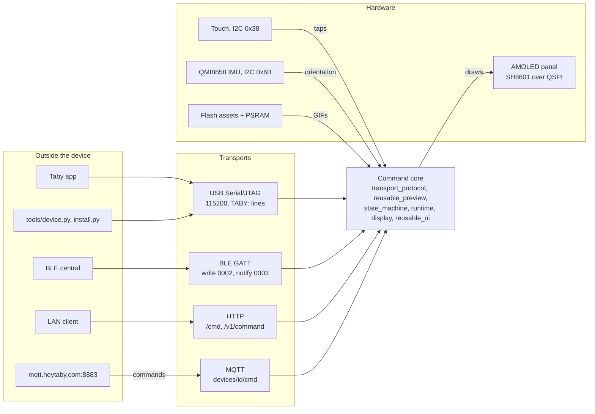
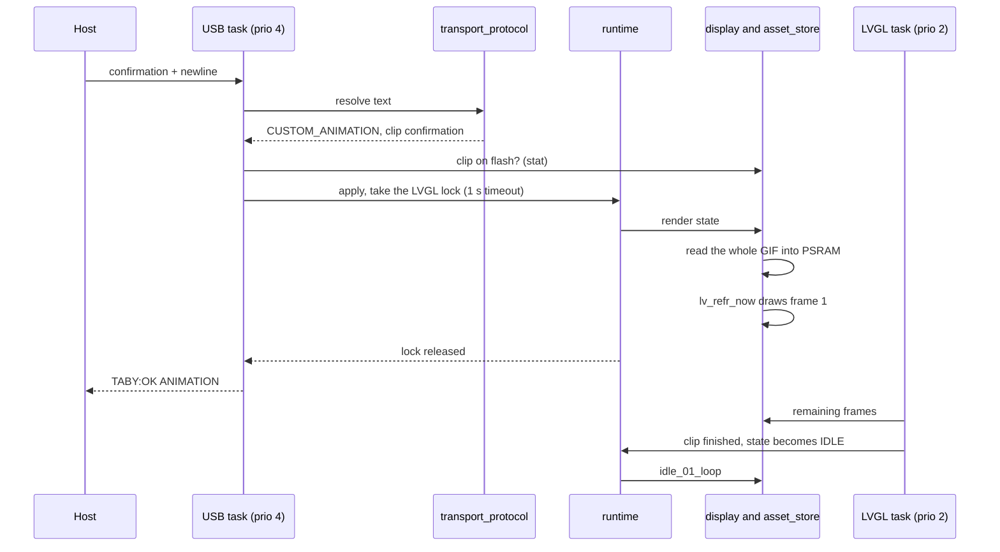
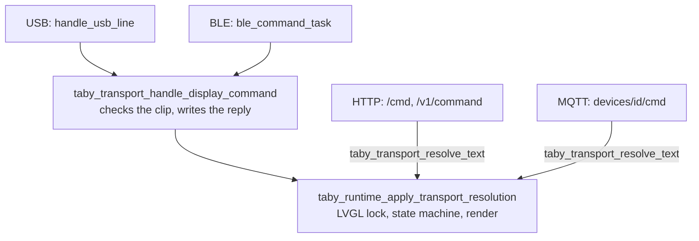
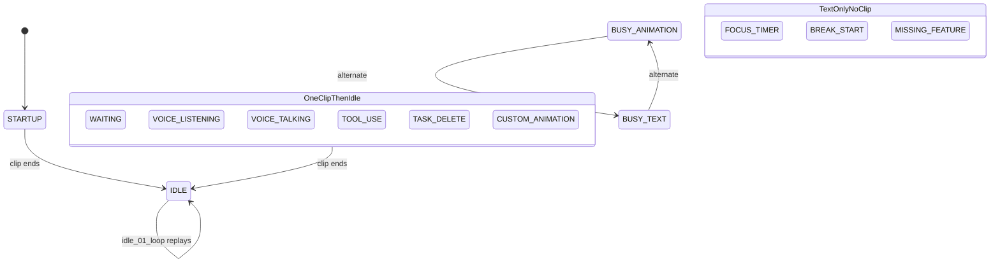
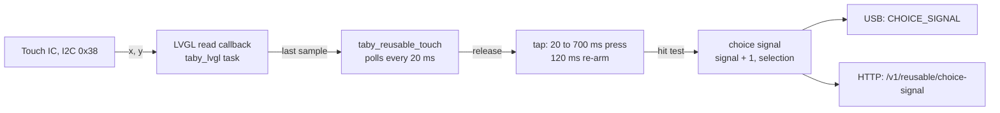
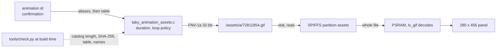
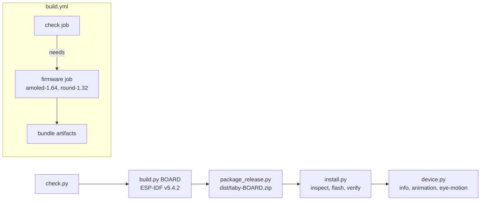

# Firmware architecture

This is a map of the firmware for new contributors: how a command reaches the
screen, what runs at the same time, where things are stored, and which files
to change for common contributions. It describes firmware 1.2.0 (`3681c7f`).
When code and this page disagree, the code is right. Please fix the page in
the same pull request.

[README.md](README.md) remains the reference for building and for the device
commands. File names below are in `firmware/main/`, and most drop the `taby_`
prefix in diagrams.

## The whole system

Four transports feed one command core, which drives one screen. The Taby app
normally owns USB. The HTTP endpoints exist only after Wi-Fi setup and have no
request authentication (see [Bluetooth and local Wi-Fi](README.md#bluetooth-and-local-wi-fi)).

MQTT starts only on a board with factory credentials and saved Wi-Fi
(`taby_mqtt.c`).

## Modules by layer

Calls go downward. Line counts are from `wc -l` and show where most of the
code is.

| Layer | Modules (lines) |
| --- | --- |
| Transports | `usb_serial` (1,078), `ble_transport` (1,038), `http_server` (1,212), `mqtt` (333) |
| Parsing | `transport_protocol` (678), `reusable_preview` (1,066, the `UI/` parser), `line_reader` (49) |
| Core | `runtime` (678, owns the display lock), `state_machine` (208), `onboarding` (866) |
| Drawing | `display` (624), `reusable_ui` (2,720, cards), `animation_assets` (273, clip table), `asset_store` (204, SPIFFS), `idle_eyes` (208), `eye_motion` (134) |
| Board | `board_amoled_1_64` (1,630, both boards through `TABY_HARDWARE_ROUND_1_32`), `power` (184), `power_button` (104) |
| Setup and storage | `identity` (228), `transport_prefs` (163), `wifi` (1,158), `build_info` (55) |

`app_main.c` starts the modules in this order: identity and NVS, board,
reusable UI, asset store, runtime (the startup clip), power button, USB
serial, transport preferences, power, Wi-Fi, Bluetooth when it is preferred
or setup is unfinished, then onboarding.

`dns_server.c` is compiled but `start_dns_server` has no caller.
`taby_visual_smoke.c` is not listed in `main/CMakeLists.txt`.

## One command, end to end

This is `confirmation` over USB. Everything up to the reply runs on the USB
task, including the first frame, which is drawn while the task holds the
LVGL lock. The LVGL task plays the remaining frames.

- Entry: `usb_serial_task`, then `handle_usb_line`, then
  `taby_transport_handle_display_command`.
- The clip check is `taby_display_animation_available`. A clip the board
  lacks stops there and is answered `TABY:OK <STATE> unsupported_animation <id>`.
- A `UI/...` card goes through `taby_reusable_preview_render_ui_command`
  instead. It does not call `lv_refr_now`, and its reply names the state
  machine's state, for example `TABY:OK IDLE`.

## Two paths inside

USB and Bluetooth share the handler that checks the clip exists and builds
the reply. HTTP and MQTT call the resolver and the runtime directly.

| Transport | Reply to a display command |
| --- | --- |
| USB | `TABY:OK <STATE>` line |
| BLE | `OK <STATE>` on the event characteristic (0003) |
| HTTP | JSON, for example `{"ok":true,"accepted":false}` with `202` for text it does not recognise |
| MQTT | message on the ack topic |

## State machine

Any command sets its state directly, from any state. Without a command, only
a clip ending moves the machine.

- `taby_state_machine_on_animation_complete` holds the rules. `taby_runtime.c`
  replays IDLE, and plays the second clip of an `a>b` command before those
  rules apply.
- Short codes in `taby_transport_protocol.c` map onto states: `S` stop, `VL`
  and `VT` voice, `U` tool use, `D` delete, `TBY...` busy, `F` focus, `P2`
  break. Some play a named clip, for example `A` plays `trophy` titled
  ACHIEVEMENT. Any other text is looked up as an animation id.

## Tasks and locks

One non-recursive mutex, the LVGL lock (`board_amoled_1_64_lock`), guards
everything on screen. Functions ending in `_locked` expect the caller to
hold it. No task is pinned to a core.

| Task | Priority | Wakes on | Takes the LVGL lock |
| --- | --- | --- | --- |
| `taby_lvgl` | 2 | `lv_timer_handler`, 1 to 500 ms | yes, every loop |
| `taby_orientation` | 2 | IMU sample every 100 ms (1.64 only) | yes |
| `taby_usb_serial` | 4 | one byte, 20 ms timeout | yes, through `runtime` |
| `taby_ble_cmd` | 4 | command queue | yes, through `runtime` |
| `httpd` | ESP-IDF default | HTTP request | yes, through `runtime` |
| `taby_onboarding` | 4 | 20 ms | yes |
| `taby_reusable_touch` | 4 | 20 ms, only while a card takes input | no |
| `taby_power_button` | 4 | GPIO0 every 50 ms | no |
| `taby_mqtt_state` | 4 | state publish every 15 s | no |

Smaller locks: `s_i2c_mutex` (touch and IMU I2C), and spinlocks for the
choice signal (`s_choice_signal_lock`), the tap and gesture counters
(`s_touch_signal_lock`) and orientation state.

## Touch to choice signal

The counter does not reset between cards, so a client reads it before
showing a prompt and compares afterwards. Board-level taps are counted
separately in `TOUCH_SIGNAL` (60 ms minimum, 180 ms re-arm).

## From animation id to pixels

The GIF is read into PSRAM in one piece; it is not streamed from flash.
Icons are separate 4-bit alpha files under `/assets/icons/`.

## Flash layout

| Partition | 1.64 offset | 1.64 size | 1.32 size | Written by `install.py` |
| --- | --- | --- | --- | --- |
| bootloader | `0x0` | 32 KB | 32 KB | yes |
| partition table | `0x8000` | 4 KB | 4 KB | yes |
| `nvs` (settings) | `0x9000` | 64 KB | 64 KB | no |
| `otadata` | `0x19000` | 8 KB | 8 KB | yes |
| `phy_init` | `0x1b000` | 4 KB | 4 KB | no |
| `factory_data` | `0x1c000` | 16 KB | 16 KB | no |
| `coredump` | `0x20000` | 128 KB | 128 KB | no |
| `ota_0` (app) | `0x40000` | 4 MB | 3 MB | yes |
| `assets` (SPIFFS) | `0x440000` | 11.75 MB | 4.75 MB | yes |

On a 1.64 V1 running 1.2.0, the boot log showed the asset pack using
11,286,466 of 11,317,841 bytes, about 31 KB free. The app used 1.74 MB of its
4 MB. A new clip on this board currently needs space made for it.

## First boot and settings

The chooser shows a single USB-C button, and any tap selects USB. Bluetooth
and Wi-Fi setup screens are reached through commands such as
`TRANSPORT_MODE` and `SETUP_START`. A board with factory data is marked as
USB-onboarded at first boot. If setup was left unfinished, the preference is
reset to unknown at the next boot.

| NVS namespace | Keys | Holds |
| --- | --- | --- |
| `taby_meta` | `device_id`, `claimed`, `claimed_by` | identity |
| `taby_setup` | `done`, `pref` | onboarding state; pref 0 unknown, 1 USB, 2 Wi-Fi, 3 Bluetooth |
| `taby_display` | `orientation`, `eye_motion` | orientation mode, resting-eye mode |
| `taby_wifi` | per-slot `ssid`, `pwd` and others, `last_ssid` | up to 5 saved networks |

## Tools and CI

`install.py verify` compares the version fields in `INFO`. To confirm the
images on the chip, compare flash digests with `esptool verify_flash`.

## Where to change what

| To... | Change | Keep in mind |
| --- | --- | --- |
| Add or replace an animation | `assets/BOARD/a/`, `catalog.json`, `manifest.json`, `taby_animation_assets.c` | hashed file name, byte length and SHA-256 in the catalog, manifest under 16 KiB, SPIFFS must fit |
| Add a card type | `taby_reusable_preview.c` (parse), `taby_reusable_ui.c` (draw) | keep existing `UI/` kinds and fields compatible |
| Add a USB command | `handle_usb_line` in `taby_usb_serial.c`, [README.md](README.md#talk-to-taby) | older firmware answers `TABY:ERR unsupported_command`; list it in `INFO` capabilities |
| Add a state or short code | `taby_state_machine.*`, `taby_transport_protocol.c` | `tests/test_protocol.py`; an unknown animation stays `OK ... unsupported_animation` |
| Support a new board | see [Add a board](README.md#add-a-board) | never change existing boards' pins |
| Change the host tools | `tools/*.py`, `tests/test_device.py`, `tests/test_install.py` | run `tools/check.py` and the tests |

`tests/test_protocol.py` and `tests/test_eye_motion.py` compile the real
firmware sources against the stubs in `tests/host/`, so protocol and parsing
changes can be tested without a board.
